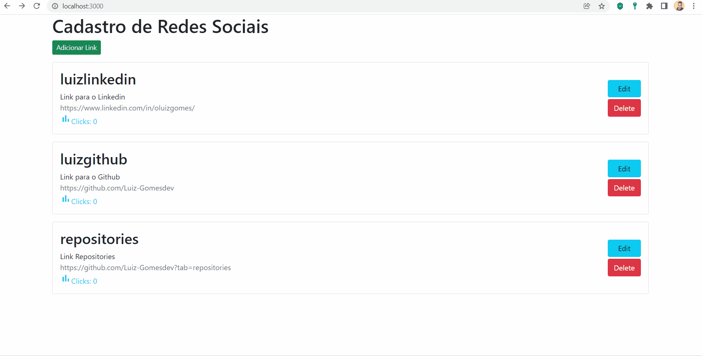

# Sobre o Projeto 🚀

Projeto de estudo utilizando o Mongo DB com interação entre JavaScript e Node JS.

# Tecnologias Utilizadas

Utilizei o Mongo DB para armazenar os dados, Java Script e Node JS para desenvolver a página de cadastro.

# Tela de Aplicação 

